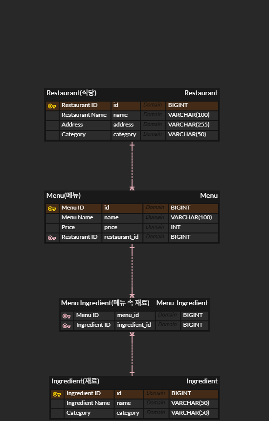

# No-Ingredient (기피 재료 제외 식당 검색 서비스)
사용자가 못 먹거나 기피하는 재료를 선택하면, 해당 재료가 포함된 메뉴를 판매하는 식당을 제외하고 안전한 식당 리스트만 제공하는 백엔드 시스템입니다.


## Tech Stack
- **Language**: Java 17

- **Framework**: Spring Boot 3.5.x

- **Data**: Spring Data JPA

- **Database**: MySQL

- **Documentation**: SpringDoc OpenAPI (Swagger)

## 데이터베이스 설계 (ERD)


- **설계 핵심**: 
  - ```Menu```와 ```Ingredient```를 **N:M(다대다) 관계**로 설정하고, 중간에 ```MenuIngredient``` 매핑 테이블을 두어 유연하게 재료 정보를 관리할 수 있도록 설계했습니다.
  - '식당 - 메뉴 - 재료'로 이어지는 계층 구조를 통해 '특정 재료가 포함된 메뉴'를 가진 식당을 효율적으로 필터링할 수 있게 구성했습니다.

## Key Features
- **N:M 관계 매핑**: 메뉴(```Menu```)와 재료(```Ingredient```) 사이의 다대다 관계를 ```@ManyToMany``` 및 매핑 테이블로 구현

- **기피 재료 필터링**: ```NOT EXISTS``` 서브쿼리를 활용하여 특정 재료가 포함된 메뉴를 가진 식당을 동적으로 제외

- **전역 예외 처리**: 사용자가 잘못된 재료를 입력하거나 검색 결과가 없을 때 명확한 메시지를 응답하는 예외 핸들링

## Troubleshooting
#### 1. JSON 무한 순환 참조(Infinite Recursion) ####
- **Issue**: ```Restaurant``` 와 ```Menu``` 엔티티의 양방향 연관 관계에서 식당 정보를 조회할 때, Jackson 라이브러리가 객체를 JSON으로 만드는 과정에서 무한 루프에 빠지는 상황이 발생했습니다.

- **Cause**: ```Restaurant``` 가 ```Menu``` 리스트를 부르고, 각 ```Menu``` 는 다시 ```Restaurant``` 를 참조하는 상태에서 이러한 엔티티 클래스를 API의 응답으로 직접 반환했던 것이 원인이었습니다.

- **Solution**: DTO(Data Transfer Object) 패턴을 도입하여 엔티티와 응답 데이터를 분리했습니다. 클라이언트가 필요로 하는 데이터(메뉴 객체 자체가 아닌 메뉴 이름 리스트 등)만을 추출하여 반환하도록 ```RestaurantResponseDTO```를 설계하여 순환 참조에서 벗어났습니다.

- **배운 점**: 엔티티는 DB 구조를 표현하는 용도로, API 응답은 DTO 구조를 통해 엔티티를 직접 응답값으로 반환하지 않아야 함을 알게 되었습니다.

#### 2. JPQL 경로 매핑 및 오타 디버깅 ####
- **Issue**: ```@Query``` 어노테이션을 사용하여 기피 재료 필터링 쿼리를 작성했으나, 애플리케이션 실행 시 쿼리 파싱 오류로 인해 서버가 구동되지 않았습니다.

- **Cause**: JPQL은 SQL과 달리 '테이블명'이 아닌 '엔티티 명과 필드 명'을 기준으로 작동하는데, 엔티티에 정의된 변수명(```menuIngredients```)을 SQL에 쓰던 것(```ingredients```)로 적거나 단순 오타가 발생하여 매핑에 실패했습니다.

- **Solution**: 엔티티 클래스의 필드명을 재확인하여 ```JOIN``` 및 ```WHERE``` 절에서 정확한 경로 표현식을 사용하도록 수정했습니다. 특히 ```NOT EXISTS``` 와 서브쿼리를 조합하여 기피 재료가 포함된 식당을 정확히 제외하는 복합 쿼리를 완성했습니다.

- **배운 점**: JPQL 쿼리 파싱 기준이 Java 엔티티임을 알았고, 이를 다룰 때 DB 테이블과 엔티티 이름이 다르다면 테이블 구조와 엔티티 설계를 더 세밀하게 살펴야 함을 깨달았습니다.

#### 3. 데이터 무결성 보장을 위한 SQL 설계 (Hardcoded ID vs Subquery) ####
- **Issue**: 테스트 데이터 삽입을 위해 data.sql 파일 작업 중, ID 값을 수동으로 입력할 때 테이블 간의 FK 키 참조가 꼬여 예상한 식당과 재료가 매핑되지 않는 상황이 발생했습니다.

- **Cause**: 데이터를 추가하고 삭제하고 다시 추가하는 여러 과정에서 무의식적으로 생각했던 특정 재료의 ID값이 다른 재료와 매핑될 확률이 매우 높아지고 유지보수가 불가능했습니다. 

- **Solution**: ID를 직접 작성하는 방식 대신 이름을 기반으로 서브쿼리를 사용하도록 변경했습니다. ```INSERT INTO ... SELECT``` 문법을 활용해 DB가 직접 이름에 맞는 ID를 찾아 매핑하게 함으로써 데이터 입력의 정확도를 높였습니다.

- **배운 점**: 초기에 편하다고 하드코딩하는 방식은 옳지 않음을 깨달았고, 초기 데이터 구축 단계에서도 자동화된 방식을 채택해야 이후에 데이터 규모가 커질 때도 데이터의 무결성을 지킬 수 있다는 점을 알게 되었습니다.

#### 4. API 엔드포인트 충돌 (Ambiguous Mapping) ####
- **Issue**: 특정 URL로 요청을 보낼 때 스프링 부트가 어떤 메서드를 실행해야 할지 결정하지 못하고 에러를 발생시켰습니다.

- **Cause**: 동일한 엔드포인트 경로(```/api/restaurants```)에 같은 HTTP Method(POST)를 사용하는 메서드가 식당 등록 기능, 검색 기능 총 두 개 존재했습니다.

- **Solution**: RESTful API 설계 원칙에 따라 Resource는 유지하면서 검색과 같은 특정 행위를 구분할 수 있도록 경로를 분리했습니다. 검색 API의 경우 ```/search``` 경로를 추가하여 모호성을 제거했습니다.

- **배운 점**: 자원은 URL로 표현하고, 그 자원에 대한 행위는 Method로 표현하는 RESTful 설계 방식을 몸소 느낄 수 있었습니다. 그리고 이러한 원칙에도 불구하고 GET 방식 대신 POST 방식을 사용하여, URL에 행위에 대한 느낌이 있지만 재료가 많아지는 경우 URL 길이가 길어짐을 고려하여 더 실용적인 API 설계로 확장할 수 있음을 알게 되었습니다. 
 
## API Specification
#### 식당 검색 (POST)
``` POST /api/restaurants/search ```

#### Request Body

```
JSON

["토마토", "오이"]
```

#### Response Body (DTO)

```
JSON

[
  {
    "id": 4,
    "name": "사당 마라탕",
    "address": "동작구",
    "category": "중식",
    "menuNames": ["기본 마라탕"]
  }
]
```

## Development Status (진행 상황)

현재 프로젝트는 핵심 기능 구현 단계에 있으며, 전체 로드맵의 약 50%를 소화한 상태입니다. 
단순한 기능 구현을 넘어 서버의 동작 원리를 이해하고 코드의 품질을 높이는 과정을 병행하고 있습니다.

### 완료된 항목
- **기획 및 설계 (1주차)**
  - [x] MVP 기능 명세 및 사용자 흐름(User Flow) 정의
  - [x] 데이터베이스 ERD 설계 (Restaurant, Menu, Ingredient 관계 매핑)
  - [x] Spring Boot 레이어드 아키텍처(Controller-Service-Repository) 설정
- **핵심 로직 개발 (2주차)**
  - [x] JPA를 활용한 도메인 엔티티(Entity) 구현 및 연관관계 설정
  - [x] 식당, 메뉴, 재료 관리를 위한 기초 CRUD API 개발
  - [x] `NOT IN` 쿼리를 활용한 기피 재료 제외 필터링 로직 구현
### 진행 중 및 예정 항목
- **기능 고도화 및 안정화 (3주차 - 진행 중)**
  - [ ] `@ControllerAdvice`를 활용한 전역 예외 처리(Global Exception Handling)
  - [ ] QueryDSL 등을 활용한 다중 필터링 동적 쿼리 최적화
  - [ ] JUnit5와 AssertJ를 이용한 비즈니스 로직 단위 테스트 작성
- **프론트엔드 연동 (4주차)**
  - [ ] React/Next.js 기반의 검색 및 필터링 UI 구현
  - [ ] Axios를 이용한 비동기 API 통신 및 CORS 문제 해결
- **배포 및 문서화 (5주차)**
  - [ ] AWS EC2 및 Docker를 활용한 서버 배포
  - [ ] 프로젝트 회고 및 기술 블로그(Velog) 포스팅 정리
